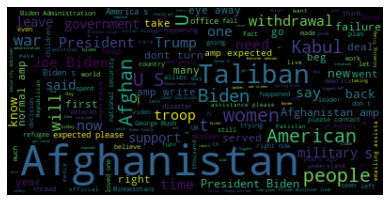
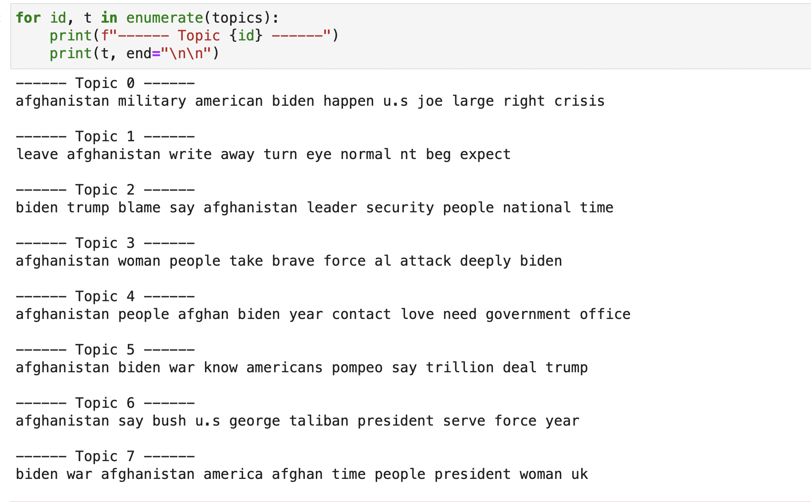

### Minimally Viable Product

The U.S. withdrew its troops from Afghanistan on May 1 after nearly a two decade long engagement/commitment. Shortly after on August 15, the Afghan government surrendered as the nation's capital Kabul was captured by Taliban forces. I wanted to gauge the sentiment of English speaking world by analyzing Tweets with the hashtag "Afghanistan", in hopes to anticipate both the short and long-term effects. Ideally, this would capture beyond just the economic and political changes that are looming. 

Below, I have produced a WordCloud as well as Topic Modeling output. However, delineating among the various topics is difficult at the moment. With the final delivery, I hope to refine topic modeling further and also perform a timeline-based sentiment analysis.

