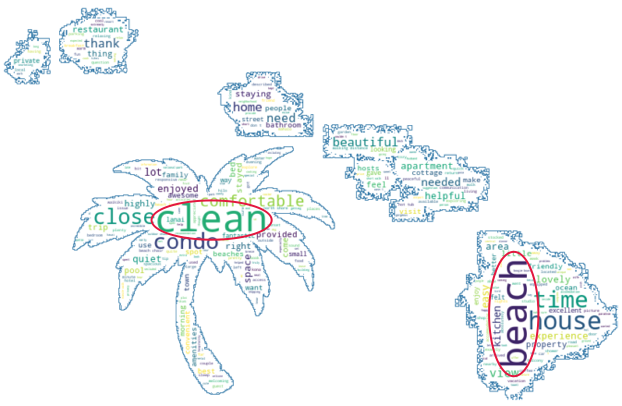
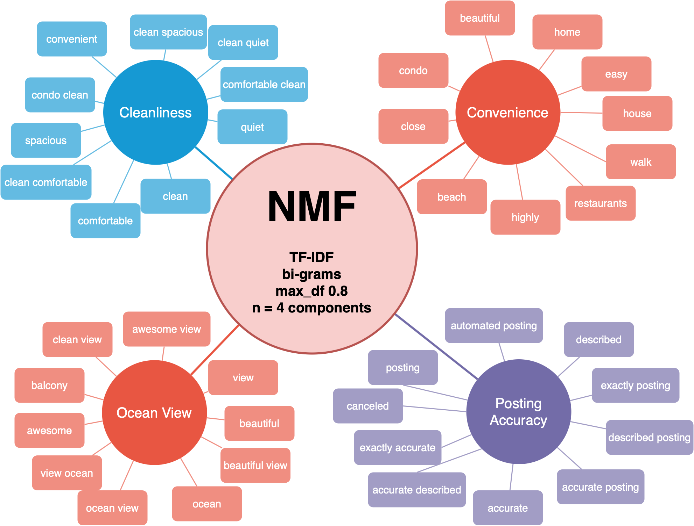

# Topic Filter Rating of Hawaii Airbnb Listings via Natural Language Processing
Jon Yu

## Abstract
Airbnb has experienced exponential growth since its launch 2008. Aided by low mortgage rates in recent years which saw 56% quarter to quarter increase in multifamily unit investments and surge of new landlords (https://capitalcounselor.com/airbnb-statistics/), Airbnb currently observes 14,000 new hosts per month in 2021 (https://capitalcounselor.com/airbnb-statistics/). However, becoming a multi-property landlord does not necessarily pave the way to financial independence as the U.S. has reported 50% relative increase in unemployment from July 2019 to July 2021 (https://data.bls.gov/timeseries/LNS14000000).

As a newly entering entrepreneur who isn't an established superhost, what can you do to appeal to guests and maximize your Airbnb listing's occupancy rate? To aid in this pursuit, I decided to launch this natural language processing and unsupervised learning project.

## Data
Honolulu, Hawaii, boasts the highest Airbnb occupancy rate in the U.S. at 68% (https://capitalcounselor.com/airbnb-statistics/). Hence, the below two data sets from Inside Airbnb (http://insideairbnb.com/get-the-data.html) detailing Hawaii Airbnb's serve as the crux of this project. 

1. 21,808 listing entries
2. 603,048 review entries (documents of the corpus)

The 300 reviews with no comments were discarded. Roughly 1.5% of the reviews were determined to be non-English using the LANGDETECT module. As the GOOGLETRANS module could not handle these due to hitting the API quote, these foreign reviews were also discarded.

Subsequent to cleaning and text preprocessing, two data frames were together using the listing ID.

## Algorithms/Tools

- Pandas to ingest and clean data
- LANGDETECT to automatically detect review language and GOOGLETRANS to attempt to translate the non-English reviews
- NLTK for text pre-processing, including lemmatization, stopwords
- WordCloud for visualizing highest frequency words in corpus
- Scikit-Learn for: 
    - Scaling
    - Vectorization (Count Vectorizer, TF-IDF)
    - Topic modeling (NMF, LSA)
    - Dimensionality reduction (PCA)
    - Clustering (KMeans)

## Findings

Text preprocessing and constructing the ever-evolving stopword list was an iterative procedure. Looking at the Word Cloud, the words "beach" and "clean" clearly stood out and lent direction to the possible topics.

Among the four-way combination resulting from LSA, NMF, Count-Vectorizer, and TF-IDF using three to ten components, NMF TF-IDF at four components provided best interpretability.

## Conclusions

## Communication
The presentation slide deck is available [here](https://github.com/runjon90/NLP_Unsupervised_Learning/blob/main/Slidedeck.pdf). In addition to a [sample video](https://github.com/runjon90/NLP_Unsupervised_Learning/blob/main/Hidden%20Rating%20Demo%20on%20Tableau.mov) of the Tableu model depicting the alternative Airbnb rating system, an online deployment is also available at https://public.tableau.com/app/profile/jon1263/viz/NLPAirbnb/Sheet1?publish=yes. Lastly, the entirety of the code used can be found within this [repo](https://github.com/runjon90/NLP_Unsupervised_Learning/tree/main/Code).
